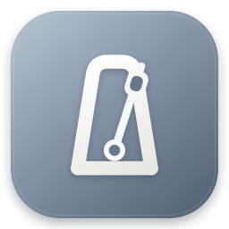

<p align="center">
  
</p>

<h1 align="center">Mactronome</h1>

<p align="center">
  <strong>macOS를 위해 만든, 정확하고 지연 없는 네이티브 메트로놈</strong>
</p>

<p align="center">
  <a href="https://github.com/mongmeo-dev/mactronome/releases/latest"></a>
  
  
</p>

<p align="center">
  <a href="README.md">English</a> | 한국어
</p>

---

Mactronome은 박자에 민감한 연주자를 위한 메트로놈입니다. 모든 클릭 소리를 오디오 스레드에서 직접 합성하고 배치하기 때문에, 설정한 템포에 정확히 맞춰 소리가 납니다. 박이 조금씩 밀리거나 첫 박이 늦게 나는 일이 없습니다. 강세 패턴, 분할 박, 템포 트레이너, 폴리리듬, 프리셋까지 매일의 연습에 필요한 기능을 모두 갖추고 있습니다.

## 주요 기능

### 🎯 정확한 박자
- **샘플 단위 스케줄링**: UI 타이머가 아닌 실시간 오디오 스레드에서 샘플 단위로 클릭을 배치합니다.
- **즉각적인 시작**: 오디오 엔진을 항상 대기 상태로 유지하므로, 재생 버튼을 누르면 수 밀리초 안에 첫 클릭이 울립니다.
- **어긋나지 않는 폴리리듬**: 보조 성부가 매 마디 주 박자에 맞춰 다시 정렬됩니다.

### 🥁 리듬과 강세
- **30~300 BPM** 템포 범위
- **자유로운 박자표**: 한 마디에 1~12박, 기준 음표는 2·4·8·16분음표 중에서 고를 수 있습니다.
- **분할 박**: 4분·8분·16분음표와 3연음·5연음·6연음을 지원합니다.
- **펄스별 4단계 강세**: 강박·중강·약박·무음. 박자 바를 클릭하면 단계가 순환하고, 우클릭하면 원하는 단계를 바로 지정할 수 있습니다.
- **3가지 클릭 음색**: Beep, Digital, Clave

### 🏋️ 연습 도구
- **템포 트레이너**: 정해 둔 마디마다 BPM을 자동으로 올려 목표 템포까지 끌어올립니다.
- **카운트인**: 메트로놈 시작 전에 최대 8마디까지 예비 박을 넣을 수 있습니다.
- **폴리리듬**: 주 박자 위에 보조 성부를 겹칩니다. (예: 3 : 4)
- **탭 템포**: 박자에 맞춰 두드리면 곡의 템포를 찾아 줍니다.
- **마디 카운터**: 지금 몇 번째 마디인지 항상 확인할 수 있습니다.
- **프리셋**: BPM, 박자표, 강세, 음색, 연습 설정을 이름 붙여 저장하고 클릭 한 번으로 불러옵니다.

### 🖥️ Mac에 어울리는 사용성
- **메뉴바 제어**: 창을 전환하지 않고 메뉴바에서 시작·정지와 템포 조절이 가능합니다.
- **컴팩트 모드**: 연주에 방해되지 않도록 창을 작은 미니 플레이어로 줄입니다.
- **항상 위에 표시**: 악보나 DAW 위에 메트로놈을 띄워 둘 수 있습니다.
- **라이트·다크 모드**: 시스템 설정을 따르거나 직접 선택할 수 있습니다.
- **비주얼 플래시**: 박자를 소리뿐 아니라 화면으로도 확인할 수 있습니다. 점멸은 초당 3회 이하로 제한되며(WCAG 2.3.1), macOS의 *동작 줄이기* 설정을 켜면 더 은은하게 표시됩니다.
- **자동 업데이트**: 새 버전을 앱 안에서 바로 받아볼 수 있습니다.

## 설치

1. [릴리즈 페이지](https://github.com/mongmeo-dev/mactronome/releases/latest)에서 최신 `Mactronome-x.y.z.dmg` 파일을 내려받습니다.
2. DMG를 열고 **Mactronome**을 **응용 프로그램** 폴더로 끌어다 놓습니다.
3. 응용 프로그램 폴더나 Launchpad에서 Mactronome을 실행합니다.

Apple의 서명과 공증을 거친 앱이므로 보안 경고 없이 바로 실행됩니다. 설치 후에는 **Mactronome → 업데이트 확인…** 메뉴에서 언제든 업데이트를 확인할 수 있습니다.

**요구 사항:** macOS 14 Sonoma 이상 (Apple 실리콘 및 Intel 지원)

## 키보드 단축키

| 동작 | 단축키 |
| --- | --- |
| 시작 / 정지 | `Space` 또는 `⌘P` |
| BPM +10 / −10 | `↑` / `↓` (또는 `⌘↑` / `⌘↓`) |
| BPM +1 / −1 | `→` / `←` (또는 `⌘→` / `⌘←`) |
| 템포 탭 | `⌘T` |
| 컴팩트 모드 전환 | `⌘⇧C` |
| 설정 열기 | `⌘,` |

템포 숫자 위에서 드래그하거나 스크롤해서 BPM을 조절할 수도 있고, 클릭해서 값을 직접 입력할 수도 있습니다.

## 사용 팁

- **박자 바를 우클릭**하면 네 단계를 차례로 넘기지 않고 원하는 강세를 바로 고를 수 있습니다.
- **스피커 아이콘을 클릭**하면 바로 음소거되고, 다시 클릭하면 이전 볼륨으로 돌아옵니다.
- 프리셋에는 음악 관련 설정만 저장됩니다. 프리셋을 불러와도 화면 모드나 창 설정은 바뀌지 않습니다.
- 음색, 연습 도구, 표시 옵션은 **설정** 창(`⌘,`)에서 변경할 수 있습니다.

## 소스에서 빌드하기

Mactronome은 Swift 6, SwiftUI, AVAudioEngine으로 만들어졌습니다.

```bash
git clone https://github.com/mongmeo-dev/mactronome.git
cd mactronome
open mactronome.xcodeproj
```

Xcode에서 `mactronome` 스킴을 선택해 실행합니다. Xcode 프로젝트는 [XcodeGen](https://github.com/yonaskolb/XcodeGen)으로 `project.yml`에서 생성되므로, 프로젝트 구성을 바꾼 경우 `xcodegen generate`로 다시 생성해 주세요.

## 피드백

버그를 발견했거나 제안하고 싶은 기능이 있다면 [이슈](https://github.com/mongmeo-dev/mactronome/issues)를 남겨 주세요.
